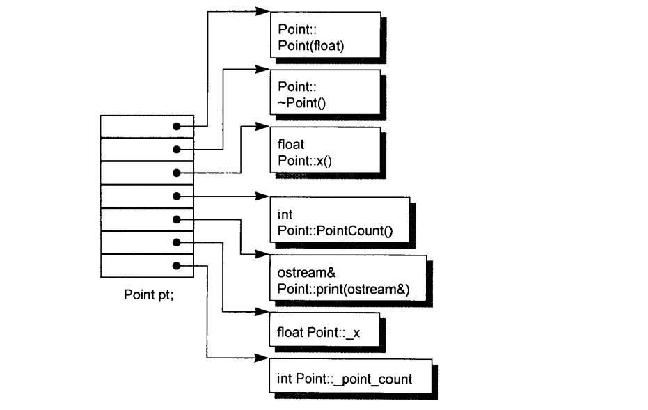

# 深度探索C++对象模型


## 第 1 章 关于对象（Object Lessons）

C++在布局以及存取时间上主要的额外负担是由 virtual 引起，包括：

*   **virtual function** 机制用以支持一个有效率的 “执行期绑定” (runtime binding).
*   **virtual base class** 用以实现 “多次出现在继承体系中的 base class，有一个单一而被共享的实体”

此外，还有一些多重继承下的额外负担，发生在 “一个 derived class 和其第二或后继之 base class 的转换” 之间。


### 1.1 C++ 对象模式（The C++ Object Model）

在 C++ 中，有两种 class data members : **static** 和 **nonstatic**，以及三种 class member functions : **static**、**nonstatic** 和 **virtual**。已知下面这个 class Point 声明：

```c++
class Point {
public:
	Point(float xval);
    virtual ~Point();
    
    float x() const;
    static int PointCount();
    
protected:
    virtual ostream&
        print(ostream &os) const;
    
    float _x;
    static int _point_count;
};
```

这个 class Point 在机器中将会被怎么样表现呢? 也就是说，我们如何模塑 (modeling）出各种 data members 和 function members 呢?


#### 简单对象模型（A Simple Object Model）

我们的第一个模型十分简单。它可能是为了尽量减低 C++ 编译器的设计复杂度而开发出来的，赔上的则是空间和执行期的效率。在这个简单模型中，一个 object 是一系列的 slots，每一个 slot 指向一个 members。Members 按其声明次序，各被指定一个 slot。每一个 data member 或 function member 都有自己的一个 slot。图 1-1 可以说明这种模型。



<div align = "center"><strong>图 1-1 &nbsp 简单对象模型 （Simple Object Model）</strong></div>

在这个简单模型中, members 本身并不放在 object 之中。只有 “指向 member 的指针” 才放在 object 内，这么做可以避免 “members 有不同的类型，因而需要不同的存储空间” 所招致的问题。Object 中的 members 是以 slot 的索引值来寻址，本例之中 \_x 的索引是 6，_point_count 的索引是 7。一个 class object 的大小很容易计算出来：“指针大小，乘以 class 中所声明的 members 数目” 便是。

虽然这个模型并没有被应用于实际产品上，不过关于索引或 slot 数目的观念，倒是被应用到 C++ 的 **“指向成员的指针” ( pointer-to-member）**观念之中，


#### 表格驱动对象模型（A Table-driven Object Model）
